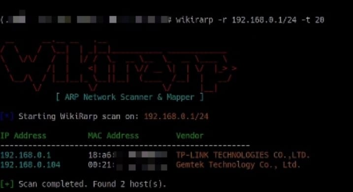

# WikiRarp 🎯

> A fast, lightweight ARP network scanner and Python library designed for network discovery, infrastructure auditing, and mapping.

Created and maintained by [wikirity](https://github.com/y1hng).

---

## Demo 📸



---

## Features 🚀

- **High Speed**: Multi-threaded ARP scanning built on Python's `concurrent.futures` for rapid host discovery.
- **Vendor Identification**: Automatically resolves MAC addresses to identify device manufacturers.
- **Dual Usage**: Use it directly from your terminal as a standalone CLI tool or import it as a core library in your Python scripts.
- **Clean Output**: Structured, color-coded terminal output powered by `colorama`.

---

## Requirements 📋

- **OS**: Linux (Requires root privileges to send raw ARP packets via Scapy).
- **Python**: Version `3.8` or higher.

---

## Installation 📦

Clone the repository and install the package locally using `pip`:

```bash
git clone [https://github.com/y1hng/wikirarp.git](https://github.com/y1hng/wikirarp.git)
cd wikirarp
sudo pip install .

```

*(Tip: If you are developing or modifying the code, install it in editable mode using `sudo pip install -e .`)*

---

## Usage 💻

Because WikiRarp interacts with raw sockets through Scapy, **root privileges (`sudo`) are required** for execution.

### Command Line Interface (CLI)

Scan a target network range using the `-r` option:

```bash
sudo wikirarp -r 192.168.1.0/24

```

#### CLI Arguments

| Argument | Description | Default |
| --- | --- | --- |
| `-r`, `--range` | Target network range to scan (CIDR notation) | **Required** |
| `-t`, `--threads` | Number of concurrent worker threads | `25` |

---

## Python Library Usage 🐍

You can easily integrate WikiRarp into your own Python automation or security scripts:

```python
from wikirarp.scanner import scan
from wikirarp.mac_lookup import get_device_vendor

# Scan the network range
target_network = "192.168.1.0/24"
hosts = scan(network=target_network, max_workers=30)

print(f"Found {len(hosts)} active host(s):\n")

for device in hosts:
    ip = device['ip']
    mac = device['mac']
    vendor = get_device_vendor(mac)
    
    print(f"IP: {ip} | MAC: {mac} | Vendor: {vendor}")

```

---

## License 📄

This project is open-source and available under the terms of the [MIT License](https://www.google.com/search?q=LICENSE).
